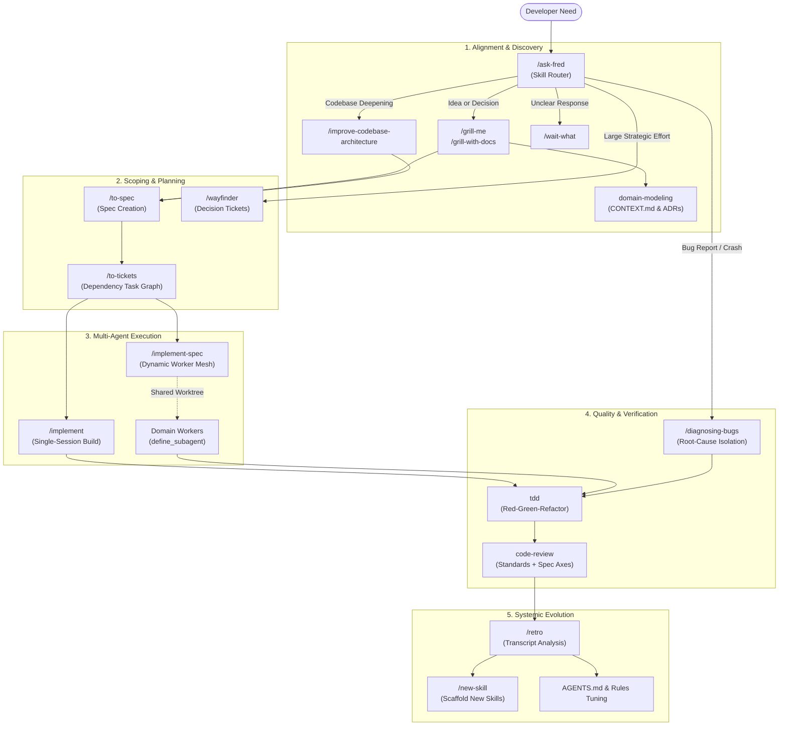

# agy-skills: Production-Grade Agent Skills for Google Antigravity

[](https://github.com/fderuiter/agy-skills/actions/workflows/deploy-docs.yml)
[](https://fderuiter.github.io/agy-skills/)
[](package.json)
[](package.json)
[](LICENSE)
[](https://github.com/fderuiter/agy-skills)

Curated, low-cognitive-load agent skills and multi-agent workflows tailored for **Google Antigravity (AGY)**, maintained by Fred de Ruiter.

Forked from [mattpocock/skills](https://github.com/mattpocock/skills) by Matt Pocock.

Developing real applications with AI coding agents is challenging. Approaches like GSD, BMAD, and Spec-Kit try to help by rigidly owning the process, but in doing so they reduce your control and make debugging difficult.

These skills are small, composable, and easy to adapt. They integrate cleanly with Antigravity and are grounded in decades of software engineering discipline.

---

## Visual Workflow Topology

The diagram below illustrates how skills compose across the full software development lifecycle in Google Antigravity:



---

## Antigravity Architecture & Advanced Synergy

`agy-skills` is purpose-built to harness the full power of Google Antigravity:

- **Dynamic Worker Mesh (`implement-spec`)**: Orchestrates concurrent subagents using `Workspace: "share"` for zero-disk-overhead worktree sharing, dispatching tickets across dependency graphs via typed `send_message` structured envelopes.
- **Deterministic Lifecycle Hooks**: Validates workspace invariants, suppresses dangerous operations (like destructive git resets), and formats outputs via `.agents/hooks.json`.
- **Deep Module Architecture**: Enforces strict entry-point encapsulation via `setup-ts-deep-modules` (dependency-cruiser) and `setup-python-deep-modules` (import-linter).
- **Ubiquitous Language & Context Economy**: Eliminates token bloat by anchoring conversations in domain glossaries (`CONTEXT.md`) and architectural decision records (`.agents/adr/`).
- **Autonomous Headless Evals**: Rigorously verifies skill activation and tool sequence fidelity using `google-antigravity` Python SDK benchmarks.

---

## Installation

agy-skills is distributed for Google Antigravity (AGY).

## Installation Methods

### 1. Antigravity Plugin (Recommended)

Copy or symlink `.agents/plugins/agy-skills` into your project's `.agents/plugins/` directory:

```bash
git clone https://github.com/fderuiter/agy-skills.git
# In your target repo:
mkdir -p .agents/plugins
ln -s /path/to/agy-skills/.agents/plugins/agy-skills .agents/plugins/agy-skills
```

### 2. Per-repo via skills.json

Add `.agents/skills.json` to the target project, pointing at this repository:

```json
{
  "entries": [
    {
      "path": "path/to/agy-skills/skills/engineering"
    },
    {
      "path": "path/to/agy-skills/skills/productivity"
    }
  ]
}
```

### 3. Global Installation

Run `npm run link` in this repository to automatically link all skills into your local Antigravity directories:

- Windows: `%USERPROFILE%\.gemini\config\skills\` and `%USERPROFILE%\.agents\skills\`
- macOS / Linux: `~/.gemini/config/skills/` and `~/.agents/skills/`

### 4. Manual Workspace Copy

Copy any individual skill folder from `skills/` directly into your workspace `.agents/skills/` directory.

## Post-Install Setup

In your agent session, run once per repository:

```
/setup-agy-skills
```

It will:
- Ask which issue tracker you use (GitHub Issues, GitLab, or local markdown files)
- Configure triage label vocabulary (/triage uses labels)
- Configure where domain documentation (CONTEXT.md and ADRs) is saved

---

## Why These Skills Exist

These skills solve common failure modes when building software with AI coding agents:

### #1: The Agent Didn't Do What I Want
The communication gap between human intent and code execution is solved by **grilling**:
- [`/grill-me`](./skills/productivity/grill-me/SKILL.md): Stateless interview for plans and non-code tasks
- [`/grill-with-docs`](./skills/engineering/grill-with-docs/SKILL.md): Stateful interview that records decisions into `CONTEXT.md` and ADRs

### #2: The Agent Is Way Too Verbose
Ubiquitous language reduces context token consumption and clarifies intent. `CONTEXT.md` gives the agent domain-specific shorthand.

### #3: The Code Doesn't Work
Feedback loops ensure correctness:
- [`/tdd`](./skills/engineering/tdd/SKILL.md): Red-green-refactor loop
- [`/diagnosing-bugs`](./skills/engineering/diagnosing-bugs/SKILL.md): Disciplined root-cause isolation and regression testing

### #4: We Built A Ball Of Mud
Caring about system design:
- [`/to-spec`](./skills/engineering/to-spec/SKILL.md): Creates comprehensive specs from conversation
- [`/to-tickets`](./skills/engineering/to-tickets/SKILL.md): Breaks specs into vertical tracer-bullet slices with blocking edges
- [`/improve-codebase-architecture`](./skills/engineering/improve-codebase-architecture/SKILL.md): Surveys the codebase for deep-module opportunities

---

## Skill Reference

Skills are grouped into **Engineering** (daily software development) and **Productivity** (alignment, communication, and writing), categorized by whether they are triggered directly by the user or invoked autonomously by the model.

### Engineering

Daily code workflows, design disciplines, testing, and multi-agent execution.

#### User-invoked

| Skill | Trigger Command | Description | Documentation |
| :--- | :--- | :--- | :--- |
| **[ask-fred](./skills/engineering/ask-fred/SKILL.md)** | `/ask-fred` | Router over the skills in this repository. | [Docs](https://fderuiter.github.io/agy-skills/skills-ask-fred) |
| **[grill-with-docs](./skills/engineering/grill-with-docs/SKILL.md)** | `/grill-with-docs` | Grilling session that builds your domain model in CONTEXT.md and ADRs. | [Docs](https://fderuiter.github.io/agy-skills/skills-grill-with-docs) |
| **[implement](./skills/engineering/implement/SKILL.md)** | `/implement` | Build work described by spec/tickets test-first and review before committing. | [Docs](https://fderuiter.github.io/agy-skills/skills-implement) |
| **[implement-spec](./skills/engineering/implement-spec/SKILL.md)** | `/implement-spec` | Orchestrate concurrent subagents to implement a full specification across its ticket task graph. | [Docs](https://fderuiter.github.io/agy-skills/skills-implement-spec) |
| **[improve-codebase-architecture](./skills/engineering/improve-codebase-architecture/SKILL.md)** | `/improve-codebase-architecture` | Scan codebase for deepening opportunities. | [Docs](https://fderuiter.github.io/agy-skills/skills-improve-codebase-architecture) |
| **[new-skill](./skills/engineering/new-skill/SKILL.md)** | `/new-skill` | Scaffold a new skill, documentation page, test fixture, and router registration. | [Docs](https://fderuiter.github.io/agy-skills/skills-new-skill) |
| **[retro](./skills/engineering/retro/SKILL.md)** | `/retro` | Analyze session transcripts to extract systemic environment improvements. | [Docs](https://fderuiter.github.io/agy-skills/skills-retro) |
| **[setup-agy-skills](./skills/engineering/setup-agy-skills/SKILL.md)** | `/setup-agy-skills` | Configure a repo for the engineering skills. | [Docs](https://fderuiter.github.io/agy-skills/skills-setup-agy-skills) |
| **[setup-mcp](./skills/engineering/setup-mcp/SKILL.md)** | `/setup-mcp` | Configure Model Context Protocol (MCP) servers with schema validation. | [Docs](https://fderuiter.github.io/agy-skills/skills-setup-mcp) |
| **[setup-python-deep-modules](./skills/engineering/setup-python-deep-modules/SKILL.md)** | `/setup-python-deep-modules` | Wire import-linter into a Python repo so each package is a deep module. | [Docs](https://fderuiter.github.io/agy-skills/skills-setup-python-deep-modules) |
| **[setup-ts-deep-modules](./skills/engineering/setup-ts-deep-modules/SKILL.md)** | `/setup-ts-deep-modules` | Enforce deep module boundaries with dependency-cruiser. | [Docs](https://fderuiter.github.io/agy-skills/skills-setup-ts-deep-modules) |
| **[to-spec](./skills/engineering/to-spec/SKILL.md)** | `/to-spec` | Turn conversation into a spec and publish to issue tracker. | [Docs](https://fderuiter.github.io/agy-skills/skills-to-spec) |
| **[to-tickets](./skills/engineering/to-tickets/SKILL.md)** | `/to-tickets` | Break specs/plans into tracer-bullet tickets with blocking edges. | [Docs](https://fderuiter.github.io/agy-skills/skills-to-tickets) |
| **[triage](./skills/engineering/triage/SKILL.md)** | `/triage` | Move issues through a state machine of triage roles. | [Docs](https://fderuiter.github.io/agy-skills/skills-triage) |
| **[wayfinder](./skills/engineering/wayfinder/SKILL.md)** | `/wayfinder` | Chart and resolve large efforts as decision tickets. | [Docs](https://fderuiter.github.io/agy-skills/skills-wayfinder) |

#### Model-invoked

| Skill | Invocation Discipline | Description | Documentation |
| :--- | :--- | :--- | :--- |
| **[code-review](./skills/engineering/code-review/SKILL.md)** | Code review / PR check | Two-axis review (Standards + Spec) of diffs in parallel subagents. | [Docs](https://fderuiter.github.io/agy-skills/skills-code-review) |
| **[codebase-design](./skills/engineering/codebase-design/SKILL.md)** | Interface & seam design | Deep module and clean seam design discipline. | [Docs](https://fderuiter.github.io/agy-skills/skills-codebase-design) |
| **[diagnosing-bugs](./skills/engineering/diagnosing-bugs/SKILL.md)** | Bug diagnosis / Debugging | Disciplined root-cause isolation and regression testing. | [Docs](https://fderuiter.github.io/agy-skills/skills-diagnosing-bugs) |
| **[domain-modeling](./skills/engineering/domain-modeling/SKILL.md)** | Glossary & ADR curation | Build and maintain project domain model and ADRs. | [Docs](https://fderuiter.github.io/agy-skills/skills-domain-modeling) |
| **[prototype](./skills/engineering/prototype/SKILL.md)** | Spikes & throwaways | Build throwaway prototypes to answer design questions. | [Docs](https://fderuiter.github.io/agy-skills/skills-prototype) |
| **[research](./skills/engineering/research/SKILL.md)** | Source investigation | Investigate questions against primary sources via background agent. | [Docs](https://fderuiter.github.io/agy-skills/skills-research) |
| **[resolving-merge-conflicts](./skills/engineering/resolving-merge-conflicts/SKILL.md)** | Git conflict resolution | Intent-traced git conflict resolution. | [Docs](https://fderuiter.github.io/agy-skills/skills-resolving-merge-conflicts) |
| **[tdd](./skills/engineering/tdd/SKILL.md)** | Test-driven development | Test-driven development with red-green-refactor loop. | [Docs](https://fderuiter.github.io/agy-skills/skills-tdd) |
| **[wizard](./skills/engineering/wizard/SKILL.md)** | Interactive human procedures | Interactive wizard script for human-only operational steps. | [Docs](https://fderuiter.github.io/agy-skills/skills-wizard) |

### Productivity

General workflow, alignment, communication, and documentation authoring tools.

#### User-invoked

| Skill | Trigger Command | Description | Documentation |
| :--- | :--- | :--- | :--- |
| **[grill-me](./skills/productivity/grill-me/SKILL.md)** | `/grill-me` | Relentless interview to resolve design decisions. | [Docs](https://fderuiter.github.io/agy-skills/skills-grill-me) |
| **[handoff](./skills/productivity/handoff/SKILL.md)** | `/handoff` | Compact conversation into handoff document for another session/agent. | [Docs](https://fderuiter.github.io/agy-skills/skills-handoff) |
| **[teach](./skills/productivity/teach/SKILL.md)** | `/teach` | Stateful multi-session learning workspace. | [Docs](https://fderuiter.github.io/agy-skills/skills-teach) |
| **[to-questionnaire](./skills/productivity/to-questionnaire/SKILL.md)** | `/to-questionnaire` | Turn decisions into questionnaires for external stakeholders. | [Docs](https://fderuiter.github.io/agy-skills/skills-to-questionnaire) |
| **[wait-what](./skills/productivity/wait-what/SKILL.md)** | `/wait-what` | Clarify and re-pitch misunderstood agent responses. | [Docs](https://fderuiter.github.io/agy-skills/skills-wait-what) |
| **[writing-beats](./skills/productivity/writing-beats/SKILL.md)** | `/writing-beats` | Assemble raw material into a narrative journey of beats. | [Docs](https://fderuiter.github.io/agy-skills/skills-writing-beats) |
| **[writing-fragments](./skills/productivity/writing-fragments/SKILL.md)** | `/writing-fragments` | Mine raw writing fragments into a single quarry file. | [Docs](https://fderuiter.github.io/agy-skills/skills-writing-fragments) |
| **[writing-shape](./skills/productivity/writing-shape/SKILL.md)** | `/writing-shape` | Shape raw material into an article paragraph by paragraph. | [Docs](https://fderuiter.github.io/agy-skills/skills-writing-shape) |

#### Model-invoked

| Skill | Invocation Discipline | Description | Documentation |
| :--- | :--- | :--- | :--- |
| **[grilling](./skills/productivity/grilling/SKILL.md)** | Structured interview loop | Reusable interview primitive across decision trees. | [Docs](https://fderuiter.github.io/agy-skills/skills-grilling) |
| **[writing-for-agents](./skills/productivity/writing-for-agents/SKILL.md)** | Agent document authoring | Discipline for authoring agent-readable documents and skills. | [Docs](https://fderuiter.github.io/agy-skills/skills-writing-for-agents) |

---

## CLI & Repository Automation

This repository includes a suite of deterministic automation tools and integrity gates:

```bash
# Link all skills into your local Antigravity directories
npm run link

# Interactively scaffold a new skill with docs and evals
npm run new-skill

# List all tracked skills by category
npm run list

# Run all static integrity gates (SEO, skills parity, links, terminology, hardcoded paths)
npm test

# Run headless Antigravity Python SDK trajectory evals
npm run test:sdk

# Run complete test suite (static gates + SDK evals)
npm run test:all

# Sync repository documentation to GitHub Wiki
npm run sync-wiki
```

---

## Documentation & Wiki

- **Documentation Portal**: [https://fderuiter.github.io/agy-skills/](https://fderuiter.github.io/agy-skills/)
- **GitHub Wiki**: [https://github.com/fderuiter/agy-skills/wiki](https://github.com/fderuiter/agy-skills/wiki)
- **Architectural Decision Records (ADRs)**: [.agents/adr/](.agents/adr/)