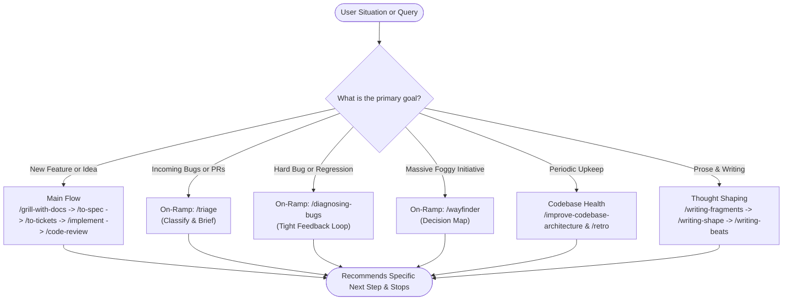

## What it does

`ask-fred` is the router over the skills in this repo. You describe the situation you are in (an idea you cannot start, a pile of incoming bug reports, a [session](https://fderuiter.github.io/agy-skills/dictionary/session) that has run long), and it names the skill or the sequence of skills that fits, plus where the human decisions in that sequence sit.

It recommends and stops. It does not grill, write a [spec](https://fderuiter.github.io/agy-skills/dictionary/spec), open a file or fire the skill it just named; what you get back is the next thing to type, and you type it. It is also a hand-written map of the skills in this repo rather than a scan of what you have installed, so it will not route you over your own skills or another author's.

## When to reach for it

You invoke this by typing `/ask-fred`; the agent won't reach for it on its own.

| Your situation | What the router gives back |
| --- | --- |
| An idea, and no idea where to start | The head of the main flow, and whether the build is small enough to skip the spec |
| Bugs and requests arriving from other people | The [triage](https://fderuiter.github.io/agy-skills/skills-triage) on-ramp, and why [tickets](https://fderuiter.github.io/agy-skills/dictionary/ticket) you generated yourself don't belong on it |
| Two skills that look interchangeable | The line between them, and it is usually one concrete test rather than a matter of taste. [grill-me](https://fderuiter.github.io/agy-skills/skills-grill-me) or [grill-with-docs](https://fderuiter.github.io/agy-skills/skills-grill-with-docs) turns on whether you are in a working directory; [grill-with-docs](https://fderuiter.github.io/agy-skills/skills-grill-with-docs) or [wayfinder](https://fderuiter.github.io/agy-skills/skills-wayfinder) turns on whether the effort fits one session |
| A long session and a decision about the [context](https://fderuiter.github.io/agy-skills/dictionary/context) | The ordered tree over the five options at a phase boundary |
| A skill you have already picked | Nothing useful. Invoke that skill directly. |

## Prerequisites

The router names skills; it does not install them. Everything it points at has to be installed for the recommendation to be actionable, and it only knows the promoted skills in this repo.

The tracker-dependent routes (triage, `to-spec`, `to-tickets`, `implement`) assume [setup-agy-skills](https://fderuiter.github.io/agy-skills/skills-setup-agy-skills) has already configured an issue tracker in the repo. The router will happily recommend them before that has happened.

## Flows, not skills

The word the skill gives you to think with is **flow**: a path *through* the skills, not a single one. Naming your situation places you on a flow at a step, which is a different answer from "here is the skill that matches your keywords". Four kinds of route exist, and the skill itself carries them in full:

- **The main flow**, idea to ship. Grill, spec, tickets, implement (or [implement-spec](https://fderuiter.github.io/agy-skills/skills-implement-spec) for concurrent subagents), review, with two branches inside it: a prototype detour when a question needs runnable code to settle, and the spec-and-tickets split, which only earns its cost when the build spans more than one session.
- **On-ramps**, for a situation that generates work and then merges onto the main flow: incoming bug reports, something broken, or an effort too foggy and too large to hold in one session.
- **Codebase health & retrospectives**, for periodic upkeep ([improve-codebase-architecture](https://fderuiter.github.io/agy-skills/skills-improve-codebase-architecture)) and session improvement ([retro](https://fderuiter.github.io/agy-skills/skills-retro)).
- **Writing tools**, for capturing fragments ([writing-fragments](https://fderuiter.github.io/agy-skills/skills-writing-fragments)), structuring articles ([writing-shape](https://fderuiter.github.io/agy-skills/skills-writing-shape)), and mapping journeys ([writing-beats](https://fderuiter.github.io/agy-skills/skills-writing-beats)).
- **Standalones**, off every flow, reached for on their own terms: the prototype, the questionnaire, the merge conflict you are already sitting in.
- **Setup & Preconditions**, repo setup ([setup-agy-skills](https://fderuiter.github.io/agy-skills/skills-setup-agy-skills)), MCP integration ([setup-mcp](https://fderuiter.github.io/agy-skills/skills-setup-mcp)), and TypeScript architectural boundaries ([setup-ts-deep-modules](https://fderuiter.github.io/agy-skills/skills-setup-ts-deep-modules)).
- **A vocabulary layer underneath**, the two references the other skills pull in when the words rather than the process are the problem.

## The phase boundary

The other idea it hands you is the **phase boundary**. A phase is a chunk of work inside a session (the [grilling](https://fderuiter.github.io/agy-skills/dictionary/grilling), the implementation, the QA), and the boundary between two of them is the only place the question "what do I do with this context?" belongs. Mid-phase there is nothing to decide: continue, or split what is left into [subagents](https://fderuiter.github.io/agy-skills/dictionary/subagent).

| Option | Take it when |
| --- | --- |
| **Continue** | The next phase wants this one verbatim, or you have [smart zone](https://fderuiter.github.io/agy-skills/dictionary/smart-zone) left. It is the only move that keeps the session as a [primary source](https://fderuiter.github.io/agy-skills/dictionary/primary-source), so rule it out first |
| **`/clear`** | Everything behind you is disposable. Cheapest move on the board, and one-way if you were wrong |
| **[handoff](https://fderuiter.github.io/agy-skills/skills-handoff)** | Something has to travel: a new [harness](https://fderuiter.github.io/agy-skills/dictionary/harness), a new directory, a colleague, a side task forked mid-phase |
| **Subagent** | The task is scoped tightly enough to run with you [away from the keyboard](https://fderuiter.github.io/agy-skills/dictionary/afk) |
| **`/compact`** | None of the above. The default, and it lands here often |

Two of those are routinely got wrong, which is why the router carries the order rather than the list. `/handoff` reads like the general bridge between windows and is not: portability is the whole of what it buys. `/compact` is the bottom of the tree rather than the first reach, because the four questions above it are each cheaper or more precise.

## Common questions

**Isn't there just a list of the skills in the right order?**

People keep asking for one in the README. This skill is that list: it is what it exists for. A static table would say `wayfinder → to-spec → to-tickets → implement → code-review` and be wrong for most situations, because the interesting parts are the branches: is there a codebase, does the build span sessions, can this question be settled by talking. The honest cost is that the router is hand-maintained and lags the repo. `/grilling` and `/resolving-merge-conflicts` both shipped long before the router named them.

**It told me half the skills aren't installed.**

A known edge case with router skills. When user-invoked skills are scoped primarily for manual slash commands, an agent might report them missing if it expects them in its autonomous tool catalog. They are installed. Type the slash command anyway, or check `.agents/skills.json` and the `skills/` directory, which are the authorities on what is registered.

**It described a skill's behaviour, and the skill doesn't do that.**

Also real, also unfixed. The router answers from its own one-line summary of each skill rather than from the skill. One detailed report tracked three instances in a single session, including a recommendation to skip [to-spec](https://fderuiter.github.io/agy-skills/skills-to-spec) on the strength of the gloss "turn the thread into a spec": `to-spec/SKILL.md` was never opened. In every case it verified only after the user pushed back, and never on its own initiative. Skipping `to-spec` there cost a real seam check, and the tickets that came out undercounted the work. When the router asserts something load-bearing about another skill, ask it to open that `SKILL.md` first. The same applies to questions the map does not cover at all, such as whether to use [plan mode](https://fderuiter.github.io/agy-skills/dictionary/agent-mode): that answer is the [model](https://fderuiter.github.io/agy-skills/dictionary/model)'s inference, not something written down here.

**Why is it prose instead of a numbered checklist?**

A fair complaint, filed as an open issue arguing that most of the routing is deterministic and the narrative makes it hard to scan. Nothing stops you asking for the compressed form: "just give me the sequence" gets you the sequence. What the prose is carrying is the conditional half: the branches, where a human decision is expected, and where to clear or compact between steps. A flat checklist drops exactly that.

**Can it route over my own skills, or another author's?**

No. Three separate proposals have asked for a router that reads your local `skills/` directory and recommends from whatever is installed. `ask-fred` is not that. It is a map of one set, maintained by hand, and it knows nothing about skills you wrote or installed from elsewhere.

**It told me to edit a SKILL.md.**

That advice is often correct and rarely durable. Someone asked it how to make [implement](https://fderuiter.github.io/agy-skills/skills-implement) close tickets, got told to add a line to the skill, and immediately spotted the problem: `npx skills update` overwrites the file, and the plugin install is read-only. Put standing behaviour in your own `CLAUDE.md` or `AGENTS.md`, or say it in the invocation. Prompt-level adaptations survive updates: pointing the flow at Linear instead of GitHub, or asking it which open tickets could run in parallel, are both things people do this way.

**It named a skill I don't have, or missed one I do.**

Check the changelog for a rename before assuming it is gone. `writing-great-skills` became [writing-for-agents](https://fderuiter.github.io/agy-skills/skills-writing-for-agents) with no alias, `to-prd` became [to-spec](https://fderuiter.github.io/agy-skills/skills-to-spec), and `pathfinder` became [wayfinder](https://fderuiter.github.io/agy-skills/skills-wayfinder). Four skills were retired outright into the skills that absorbed them: `ubiquitous-language`, `design-an-interface`, `qa` and `request-refactor-plan`. The reverse case is the router's own lag, above.

## It's working if

- It ends by naming what to type and stops there, instead of starting the work itself.
- The route it gives back mentions where to clear or compact context and where you are expected to review, not just a list of skill names.
- Where two skills are close, it says which one and why the other is wrong for you.
- Any claim it makes about another skill's behaviour shows up in the trace as it reading that skill's `SKILL.md`.
- You recognise your own situation in what it hands back, rather than the nearest generic scenario.

## Where it fits

`ask-fred` is a **standalone router** that sits over the whole set. It is never a step in a chain; it points into every chain, and it is the node the other docs pages link back to so none of them has to redraw the graph. From here you most often land on [grill-with-docs](https://fderuiter.github.io/agy-skills/skills-grill-with-docs), the head of the main flow, or [triage](https://fderuiter.github.io/agy-skills/skills-triage), the on-ramp for work that arrived rather than work you started.

It is a [secondary source](https://fderuiter.github.io/agy-skills/dictionary/secondary-source) over the skills it describes. Where the router and a `SKILL.md` disagree, the `SKILL.md` is right.
