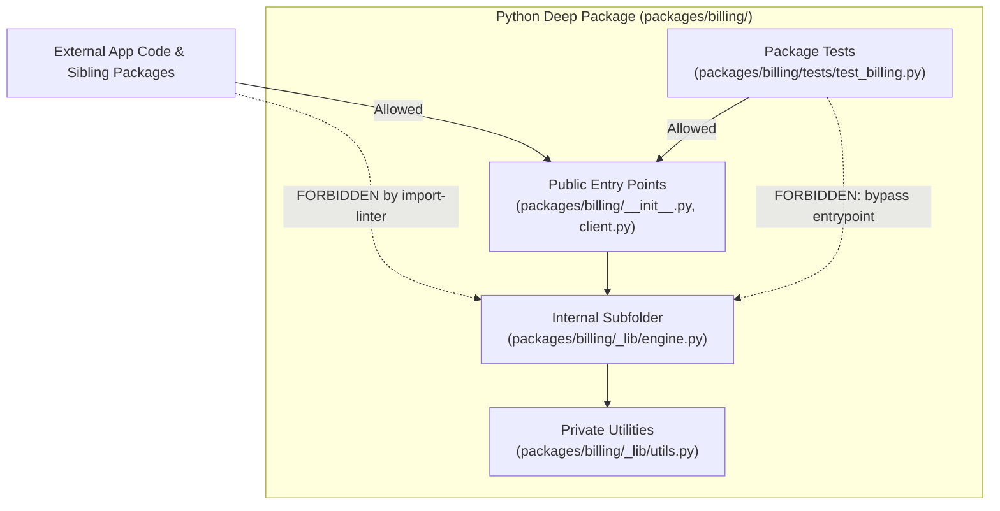

## What it does

Makes every package in a Python repository a **deep module**: a lot of behaviour behind a small interface. A package's public surface is its root entry points (`__init__.py` and root module files), while implementation details are hidden in `_lib/` or `lib/` subfolders. This skill installs [import-linter](https://import-linter.readthedocs.io/) and configures five architectural contracts, then proves the contracts bite before completing.

## When to reach for it

You invoke this by typing `/setup-python-deep-modules`, and the [agent](https://fderuiter.github.io/agy-skills/dictionary/agent) won't reach for it on its own.

Reach for it once per Python repo when structuring a multi-package architecture or cleaning up sprawling imports across services.

## The architectural contracts

The setup establishes five strict import contracts:

| Contract | Rule Enforced |
| --- | --- |
| **Entry points from app** | External application code may only import root package entry points. |
| **Entry points across packages** | Packages may only reach other packages through public entry points. |
| **Tests through entry points** | Tests import packages only through public entry points, never deep subfolders. |
| **Tests folder is private** | Application code cannot import test fixtures or helpers. |
| **No cycles** | Eliminates circular dependencies between packages. |

## Common questions

**Does this work with pyproject.toml?**
Yes. The skill configures `[tool.importlinter]` directly inside `pyproject.toml` or falls back to `.importlinter` for legacy repositories.

**Can packages expose more than just `__init__.py`?**
Yes. Any file at the package root (`client.py`, `models.py`) is an entry point. This avoids giant monolithic barrel files.

## It's working if

- `lint-imports` runs in CI and locally as part of your test suite.
- A temporary deep import into a `_lib/` folder causes `lint-imports` to fail immediately.
- The `packages/` directory has a clean convention with internal implementation hidden.

## Where it fits

A run-once setup command for Python projects, mirroring [setup-ts-deep-modules](https://fderuiter.github.io/agy-skills/skills-setup-ts-deep-modules). See [ask-fred](https://fderuiter.github.io/agy-skills/skills-ask-fred) for the full map.
