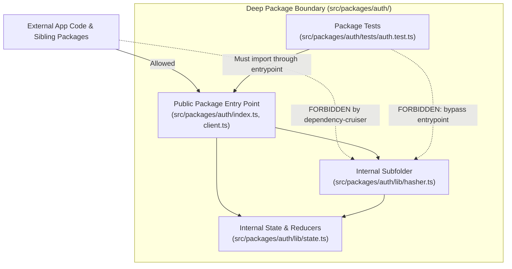

## What it does

`setup-ts-deep-modules` installs and configures [dependency-cruiser](https://github.com/sverweij/dependency-cruiser) to make every package in a TypeScript repository a deep module. It enforces architectural seams at the filesystem level with dependency-cruiser so packages are deep modules.

A deep module hides significant implementation behind a small public interface. This skill establishes package root files as the only public entry points, keeping implementation details private inside subfolders. Code outside a package (and tests for that package) can only cross through those root entry points, preventing internal leakage across module seams.

## When to reach for it

You invoke this by typing `/setup-ts-deep-modules`, and the [agent](https://fderuiter.github.io/agy-skills/dictionary/agent) won't reach for it on its own.

Reach for it when initializing a TypeScript project or adding structural guardrails to an existing codebase where imports tend to leak into internal helper files.

| The problem | The skill |
|---|---|
| Enforce physical module boundaries and private subfolders with dependency-cruiser | `setup-ts-deep-modules` |
| Learn or align on the vocabulary of deep modules, seams, and interfaces | [codebase-design](https://fderuiter.github.io/agy-skills/skills-codebase-design) |
| Survey an existing codebase for shallow modules and deepening opportunities | [improve-codebase-architecture](https://fderuiter.github.io/agy-skills/skills-improve-codebase-architecture) |
| Configure repository trackers, triage labels, and domain doc structure | [setup-agy-skills](https://fderuiter.github.io/agy-skills/skills-setup-agy-skills) |
| Build test-driven features against an established seam | [tdd](https://fderuiter.github.io/agy-skills/skills-tdd) |

## Prerequisites

A TypeScript repository with a `package.json` and a `tsconfig.json`. The skill works in both CommonJS and ECMAScript Module (`"type": "module"`) environments, supporting NodeNext, Node16, Bundler, and project references.

## Deep module boundaries



The architecture enforced by this skill establishes a strict mapping between filesystem depth and interface visibility:

```
src/packages/
  <name>/
    index.ts        <- Entry point (public). Callers import this file.
    client.ts       <- Additional entry point. Packages may expose multiple.
    lib/            <- Implementation subfolder: hidden from outsiders.
    tests/          <- Co-located tests: private subfolder.
```

Public surfaces live at the package root. Anything inside a subfolder (`lib/`, `internal/`, `tests/`) is private.

This structure eliminates two frequent anti-patterns in TypeScript projects:

- **Pass-through barrel files**: Re-exporting an entire directory tree through a single sprawling `index.ts` creates shallow interfaces and circular dependencies. Exposing several explicit root entry points (`index.ts`, `client.ts`, `server.ts`) keeps interfaces small and clear.
- **Leaky internal imports**: Importing private helpers directly (such as `import { helper } from '../package/lib/helper'`) breaks encapsulation and tightly couples callers to internal refactors.

## The dependency-cruiser rule structure

The generated `.dependency-cruiser.cjs` file configures five rules to police import boundaries:

| Rule Name | What It Enforces |
|---|---|
| `entrypoint-boundary-from-app` | Application code outside packages may only import root entry points, never subfolder files. |
| `entrypoint-boundary-across-packages` | Cross-package imports must use entry points. Files within the same package can import their own subfolders freely. |
| `tests-through-entrypoints` | Test files in `tests/` must exercise the package through its public entry points, never reaching into `lib/` directly. |
| `tests-folder-is-private` | Non-test code cannot import files or fixtures from any package's `tests/` directory. |
| `no-circular` | Circular dependency chains are forbidden. |

In modern TypeScript setups using `NodeNext` or `Node16`, imports in source files specify `.js` extensions while files on disk are `.ts`. The configuration configures `enhancedResolveOptions` and points `tsConfig.fileName` to the root `tsconfig.json`, enabling resolution across TypeScript path aliases, project references, and ESM specifiers.

## Common questions

**Why enforce boundaries with dependency-cruiser instead of TypeScript path aliases?**

TypeScript `paths` aliases provide import shortcuts, not boundary enforcement. A developer or agent can still write an import that resolves to an internal path like `@packages/billing/lib/internal-helper`. Dependency-cruiser inspects the dependency graph at lint time and halts the build whenever an import bypasses a root entry point.

**How does this support TypeScript ESM and `NodeNext` module resolution?**

In NodeNext module resolution, TypeScript requires explicit `.js` extensions in relative imports even when the source files end in `.ts`. The generated `.dependency-cruiser.cjs` configures `enhancedResolveOptions` with export conditions and links to `tsconfig.json`. Dependency-cruiser resolves `.js` import specifiers to the corresponding TypeScript source files on disk before evaluating boundary rules.

**Can a package expose multiple entry points instead of one `index.ts`?**

Yes. Every file located at the package root is a public entry point. A package can expose `index.ts`, `client.ts`, and `server.ts` side by side. Callers import the specific surface they need without forcing all code through a single bloated barrel file.

**Why are tests forbidden from importing internal `lib/` files directly?**

The interface is the test surface. If unit tests reach past the public root entry points to test private functions inside `lib/`, the tests become tightly coupled to internal implementation details. Refactoring internal files then breaks the tests even when public behaviour is unchanged. Testing exclusively through root entry points verifies the module as callers see it.

**How do I adjust the package directory location?**

Edit `PACKAGES_ROOT` at the top of `.dependency-cruiser.cjs`. The default is `src/packages`, but setting it to `packages`, `apps/core/packages`, or any custom directory automatically updates all five rules because the regular expressions derive dynamically from that single variable.

## It's working if

- Running `npm run lint:boundaries` (or `depcruise <packages-root>`) passes with zero errors on a clean repository.
- Adding a test import from a package's subfolder (such as `import { fn } from "../lib/impl"`) fails `lint:boundaries` with a `tests-through-entrypoints` error.
- Adding an import from app code directly into another package's subfolder fails `lint:boundaries` with an `entrypoint-boundary-from-app` error.
- Reverting the violation returns `lint:boundaries` to a clean passing state.
- The package root contains clear entry points while internal logic remains encapsulated in subfolders.

## Where it fits

`setup-ts-deep-modules` is a **run-once setup** and architectural enforcement tool for TypeScript repositories. It translates the design theory from [codebase-design](https://fderuiter.github.io/agy-skills/skills-codebase-design) into automated lint rules that prevent architectural decay. It works alongside [improve-codebase-architecture](https://fderuiter.github.io/agy-skills/skills-improve-codebase-architecture), which discovers shallow modules needing consolidation, and [tdd](https://fderuiter.github.io/agy-skills/skills-tdd), which develops features against clean interfaces. When you need guidance on which skill fits your current step, [ask-fred](https://fderuiter.github.io/agy-skills/skills-ask-fred) routes the complete set.
