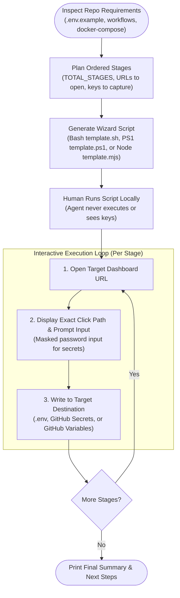

## What it does

`wizard` generates an interactive script (PowerShell on Windows, Bash on macOS/Linux, or Node.js cross-platform) that walks a human, step by step, through a manual procedure: wiring up third-party services, running a one-off migration, or moving a project from state A to state B. It opens each URL, says what to click and copy, captures what comes back, and writes it into `.env` files and GitHub Actions secrets.

The [agent](https://fderuiter.github.io/agy-skills/dictionary/agent) writes the script; it never runs it. You do, on your own machine. So a wizard is not a list of instructions you follow; it is a program that drives the procedure and holds state, and your part is to click, paste, and press Enter.

## When to reach for it

You can type `/wizard`, and the agent can also reach for it on its own. When it hits a step you have to take (a key it cannot mint, a dashboard it cannot click), it builds you a wizard instead of dumping instructions into the chat, where they scroll away.

Reach for it when the next thing blocking you is a trip through an external dashboard:

| Situation | What the wizard does |
| --- | --- |
| A new dev needs six services configured before the app boots | Opens each dashboard in order, captures the keys, writes them to `.env` and CI |
| A one-off migration needs switches flipped in a specific order | Sequences irreversible steps behind confirmation gates |
| A project has to move from state A to state B once | Walks the transition and reports what it could not do |
| You are about to write manual steps into a README | Writes an executable version instead, which cannot rot quietly |

Don't reach for it to *decide* what to build; for that, [grill-with-docs](https://fderuiter.github.io/agy-skills/skills-grill-with-docs) and [to-spec](https://fderuiter.github.io/agy-skills/skills-to-spec) are the tools.

## Prerequisites

None to generate one. The wizard it writes runs on Bash (macOS/Linux/WSL), PowerShell (Windows), or Node.js, and uses `gh` when a stage sets a GitHub secret or variable. If `gh` is missing or unauthenticated, that stage becomes a warning and the closing summary tells you what to set by hand, instead of failing the run.

## Stages

A **stage** is one focused task on one screen. The script clears the terminal between stages, so a stage that overflows the screen loses the part that scrolled away. You author stages in dependency order and set `TOTAL_STAGES`, which drives the progress display.

Scoping happens before a line is written. The [skill](https://fderuiter.github.io/agy-skills/dictionary/skill) reads the repo instead of asking cold: `.env*`, `docker-compose*`, framework config, and every `secrets.*` / `vars.*` reference in `.github/workflows/`: each of those is a value the wizard has to produce. It then shows you the ordered stage list to confirm, and only after that maps each stage to the exact path a human follows ("Dashboard → Developers → API keys → Reveal test key → copy"). Where it does not know the current UI, it asks you or checks documentation rather than inventing clicks.

For each captured value, scoping settles where it lands:

| Destination | When |
| --- | --- |
| `.env` only | Local dev needs it, CI does not |
| GitHub secret | CI reads it, and it is sensitive |
| GitHub variable | CI reads it, and it is public |
| Both `.env` and a secret | Local dev and CI both need it |
| Nowhere | The stage is a pure action: a switch flipped, a plan upgraded |

## Cross-platform templates solve the UX

The templates ship the full interactive experience across operating systems:
- **macOS / Linux / WSL**: `template.sh` (POSIX Bash with Darwin and Linux browser opening, Readline editing, and masked passwords)
- **Windows**: `template.ps1` (Windows PowerShell 5.1 and PowerShell Core 7+ with UTF-8 `.env` writes and secure strings)
- **Cross-Platform Node.js**: `template.mjs` (zero-dependency Node.js ESM script runnable on any OS with `node`)

Everything above the `STAGES` marker is a fixed library, identical in every wizard and never hand-edited. The consistency is the point. Your job is only to scope the procedure and author its stages.

The agent that writes a wizard never runs it end to end, because it opens browsers and waits for human input. It verifies statically instead: `bash -n`, `powershell -ExecutionPolicy Bypass -Command ...`, or `node --check`, and a trace that every value lands where scoping said it would, with every `set_secret` name matching a real `secrets.*` reference in CI.

## Ephemeral by default

| What you have | What to do with the script |
| --- | --- |
| A one-off migration, a personal setup, a transition you will never repeat | Save it to a scratch or `scripts/` path, run it, delete it |
| A setup path the next person on the repo will also need | Commit it and link it from the README, so they run the script instead of re-asking an agent |

## Common questions

**Do my API keys end up in the model's context?**

No. The agent writes a script; it does not run it. You run the script yourself, and it captures the key with hidden terminal entry and writes it straight to `.env` or `gh secret`. The wizard is a local CLI, and the model is not connected to it. One caveat: if you paste a key into the chat while scoping the procedure, it is in the [context](https://fderuiter.github.io/agy-skills/dictionary/context) like any other pasted text.

**How do I run the generated wizard on Windows vs macOS vs Linux?**

On macOS/Linux: `bash ./scripts/setup-wizard.sh`.
On Windows: `powershell -ExecutionPolicy Bypass -File .\scripts\setup-wizard.ps1` (or `pwsh .\scripts\setup-wizard.ps1`).
On any platform with Node.js: `node ./scripts/setup-wizard.mjs`.

**Can I go back and fix a value I mistyped?**

Not mid-run. The stages run forward, and a wrong answer means Ctrl+C and re-run. Re-running is cheap by design: any value already written to `.env` is offered back as a default, so you press Enter through the stages you got right and retype only the wrong one.

**Does it know what I've already set up?**

Partly. It reads the repo before it asks (your `.env` files, `docker-compose`, framework config, the `secrets.*` references in CI), so it scopes to values that are genuinely missing rather than starting from zero the way a README does. What it does not do is check the third-party service directly. If a key exists in your `.env` the wizard offers it back and Enter keeps it.

## It's working if

- You are shown an ordered list of stages and captured values before any script is written.
- Every URL is opened in your default browser before the value from that page is asked for.
- Secrets are typed blind with terminal echo disabled.
- Each stage fits one screen without scrolling away instructions.
- Ctrl+C and re-run picks up where you left off, offering previously saved values as defaults.
- The final screen lists what it wrote and what still needs to be done by hand.

## Where it fits

`wizard` is a reach-for-it-anytime standalone, sitting at the line where automation stops and a human has to click. Its nearest neighbour is [setup-agy-skills](https://fderuiter.github.io/agy-skills/skills-setup-agy-skills), because both exist to get a repo into a working state: that one configures this skill set, while `wizard` generates a setup path for everything else. When you are unsure which skill fits the moment, [ask-fred](https://fderuiter.github.io/agy-skills/skills-ask-fred) routes you.
