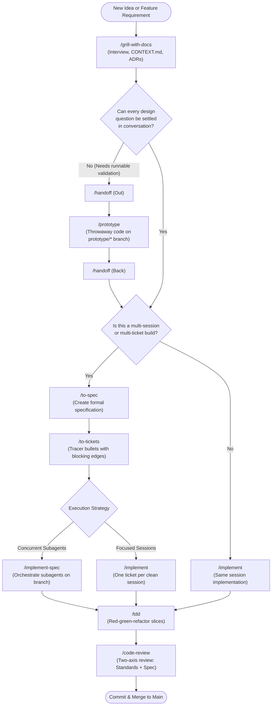
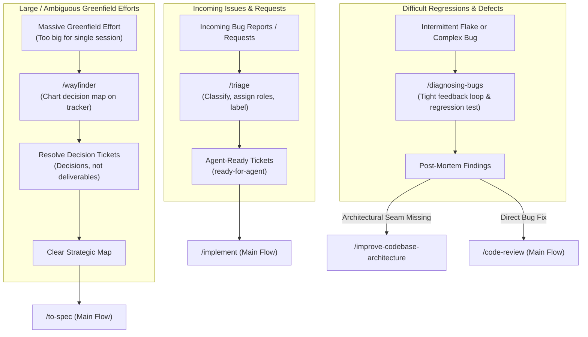
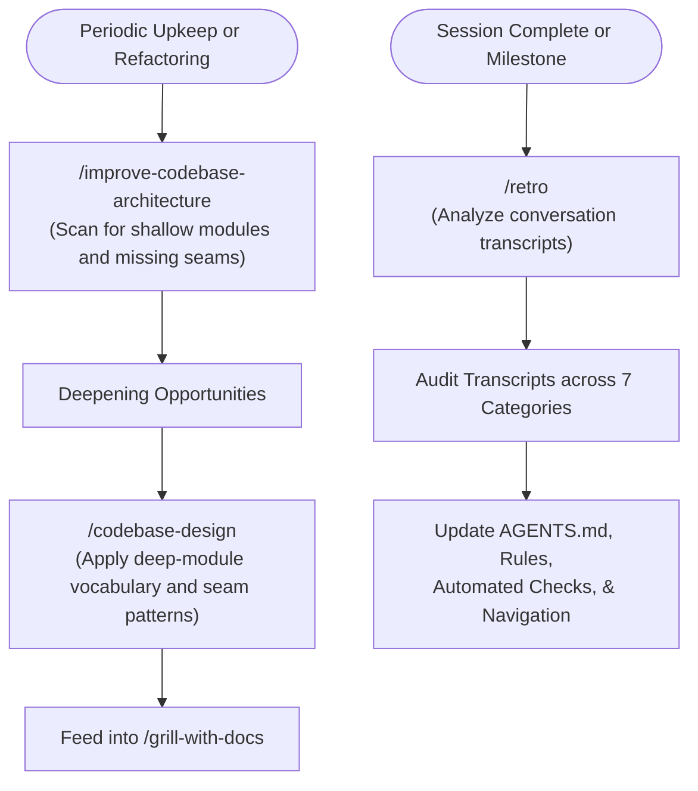
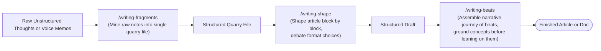
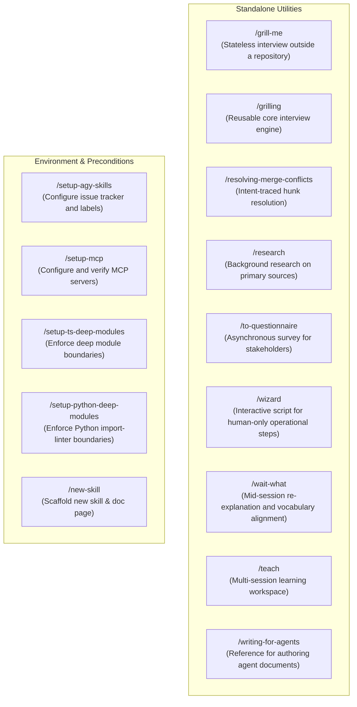

# agy-skills Documentation

Welcome to the documentation for **agy-skills**, agent skills for Google Antigravity (AGY) maintained by Fred de Ruiter.

[**Skills Index**](#engineering-skills) | [**Workflow Topology**](#workflow-topology) | [**AI Coding Dictionary**](https://fderuiter.github.io/agy-skills/dictionary/)

---

## AI Coding Dictionary

Explore the comprehensive [**AI Coding Dictionary**](https://fderuiter.github.io/agy-skills/dictionary/), the shared vocabulary for agentic software development, context management, prompt engineering, and tool execution.

- [**The Model**](https://fderuiter.github.io/agy-skills/dictionary/): Parameters, inference, effort, tokens, next-token prediction, harnesses.
- [**Sessions, Context Windows & Turns**](https://fderuiter.github.io/agy-skills/dictionary/): Context, window limits, stateful vs stateless execution, system prompts.
- [**Tools & Environment**](https://fderuiter.github.io/agy-skills/dictionary/): Tool calls, MCP servers, permissions, sandboxing.
- [**Failure Modes**](https://fderuiter.github.io/agy-skills/dictionary/): Sycophancy, hallucination, parametric knowledge, attention degradation, smart zone limits.
- [**Handoffs**](https://fderuiter.github.io/agy-skills/dictionary/): Clearing, handoffs, compaction, specs, tickets, primary vs secondary sources.
- [**Memory & Steering**](https://fderuiter.github.io/agy-skills/dictionary/): AGENTS.md, progressive disclosure, context pointers, skills, subagents.
- [**Patterns of Work**](https://fderuiter.github.io/agy-skills/dictionary/): Human-in-the-loop (HITL), AFK execution, automated checks, grilling, prototyping, vibe coding.

---

## Workflow Topology

### The Main Flow: Idea to Ship

The primary pipeline taken by new features, architectural refactors, and planned enhancements.

### On-Ramps onto the Main Flow

Structured entry points (bug triage, regressions, or massive greenfield initiatives) that prepare work before merging onto the main flow.

### Codebase Upkeep & Architecture Health

Continuous improvement loops that maintain codebase seams and tune agent instructions over time.

### Writing and Thought Shaping

Productivity workflows for mining raw fragments, shaping arguments paragraph by paragraph, and assembling narrative journeys.

### Standalone Utilities Matrix

---

## Engineering Skills

### User-invoked
- [ask-fred](./engineering/ask-fred.md): Router over the skills in this repository.
- [grill-with-docs](./engineering/grill-with-docs.md): Grilling session that builds your domain model in CONTEXT.md and ADRs.
- [triage](./engineering/triage.md): Move issues through a state machine of triage roles.
- [improve-codebase-architecture](./engineering/improve-codebase-architecture.md): Scan codebase for deepening opportunities.
- [setup-agy-skills](./engineering/setup-agy-skills.md): Configure a repo for the engineering skills.
- [setup-mcp](./engineering/setup-mcp.md): Configure Model Context Protocol (MCP) servers in Google Antigravity.
- [setup-ts-deep-modules](./engineering/setup-ts-deep-modules.md): Enforce deep module boundaries with dependency-cruiser.
- [to-spec](./engineering/to-spec.md): Turn conversation into a spec and publish to issue tracker.
- [to-tickets](./engineering/to-tickets.md): Break specs/plans into tracer-bullet tickets with blocking edges.
- [implement](./engineering/implement.md): Build work described by spec/tickets test-first and review before committing.
- [implement-spec](./engineering/implement-spec.md): Orchestrate concurrent subagents to implement a full specification across its ticket task graph.
- [wayfinder](./engineering/wayfinder.md): Chart and resolve large efforts as decision tickets.
- [retro](./engineering/retro.md): Session retrospective and transcript audit for environment tuning.

### Model-invoked
- [prototype](./engineering/prototype.md): Build throwaway prototypes to answer design questions.
- [diagnosing-bugs](./engineering/diagnosing-bugs.md): Feedback-loop driven debugging.
- [research](./engineering/research.md): Investigate questions against primary sources via background agent.
- [tdd](./engineering/tdd.md): Test-driven development with red-green-refactor loop.
- [domain-modeling](./engineering/domain-modeling.md): Build and maintain project domain model and ADRs.
- [codebase-design](./engineering/codebase-design.md): Deep module and clean seam design discipline.
- [code-review](./engineering/code-review.md): Two-axis review (Standards + Spec) of diffs.
- [resolving-merge-conflicts](./engineering/resolving-merge-conflicts.md): Intent-traced git conflict resolution.
- [wizard](./engineering/wizard.md): Interactive wizard script for human-only operational steps.

---

## Productivity Skills

### User-invoked
- [grill-me](./productivity/grill-me.md): Relentless interview to resolve design decisions.
- [handoff](./productivity/handoff.md): Compact conversation into handoff document for another session/agent.
- [teach](./productivity/teach.md): Stateful multi-session learning workspace.
- [to-questionnaire](./productivity/to-questionnaire.md): Turn decisions into questionnaires for external stakeholders.
- [wait-what](./productivity/wait-what.md): Clarify and re-pitch misunderstood agent responses.
- [writing-beats](./productivity/writing-beats.md): Assemble raw writing fragments into a narrative journey of beats.
- [writing-fragments](./productivity/writing-fragments.md): Mine raw heterogeneous writing fragments into a quarry document.
- [writing-shape](./productivity/writing-shape.md): Shape raw writing fragments into a structured article paragraph by paragraph.

### Model-invoked
- [grilling](./productivity/grilling.md): Reusable interview primitive.
- [writing-for-agents](./productivity/writing-for-agents.md): Discipline for authoring agent-readable documents.