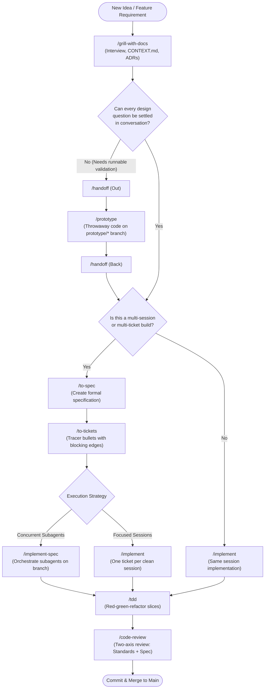
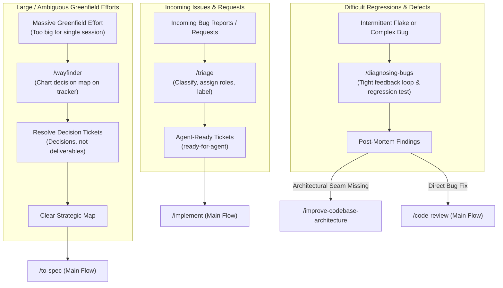
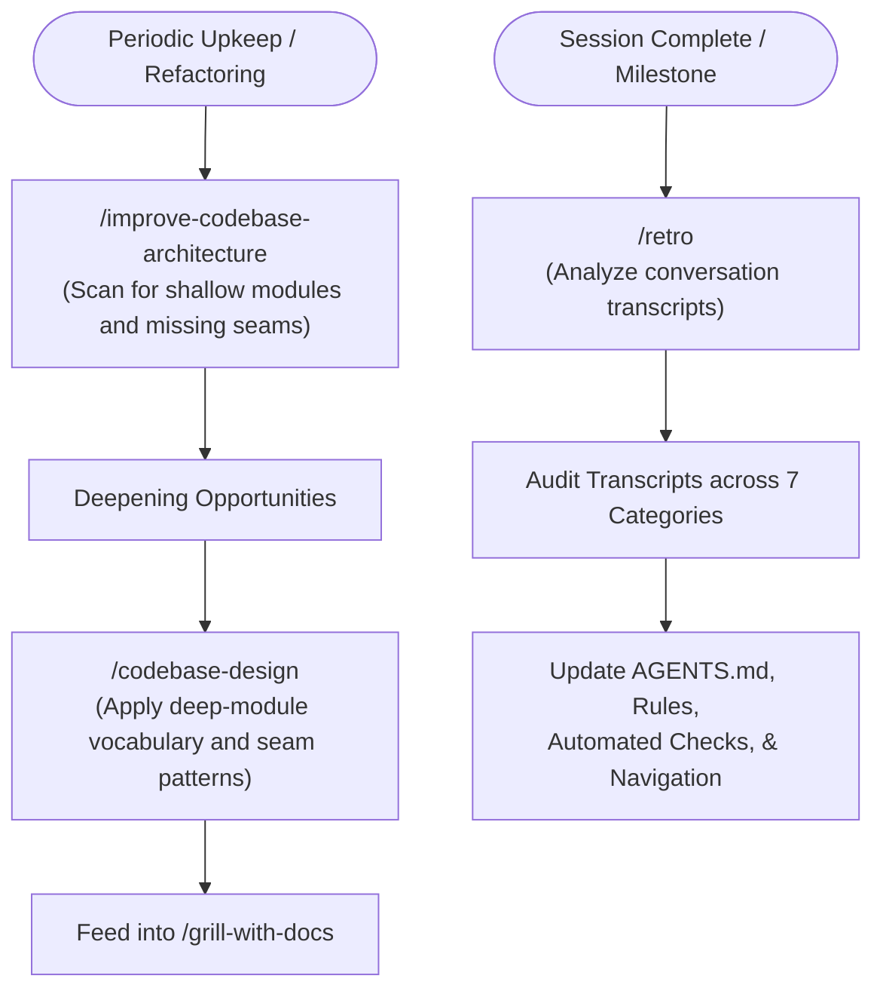
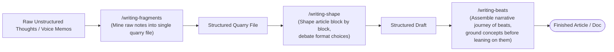
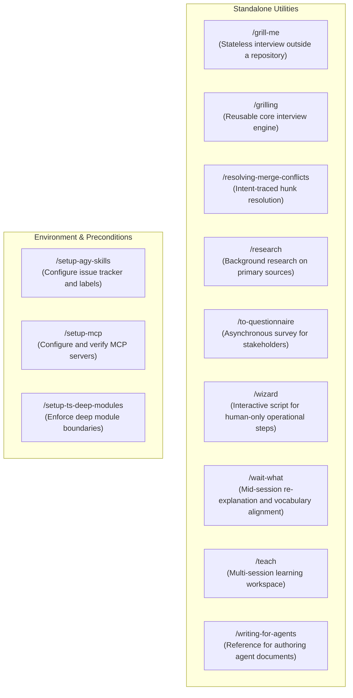

# Skill Flow Diagrams

This page provides visual Mermaid flowcharts mapping how the skills in `agy-skills` relate to each other, how work moves from an initial idea to production, and where on-ramps and standalone utilities fit in.

---

## 1. The Main Flow: Idea to Ship

The main flow represents the primary path taken by new features, architectural refactors, and planned enhancements.

### Main Flow Steps

1. **Ideation & Grilling (`/grill-with-docs`)**: The agent conducts an in-depth interview to explore assumptions, establish domain definitions in `CONTEXT.md`, and record architectural decisions in ADRs.
2. **Prototype Detour (`/prototype`)**: If a design choice requires concrete validation (UI aesthetics, state transition nuance, API ergonomics), work hands off (`/handoff`) to a temporary prototype branch and returns once verified.
3. **Specification & Ticketing (`/to-spec`, `/to-tickets`)**: Larger efforts are formalized into a spec and broken down into tracer-bullet tickets with explicit blocking relationships.
4. **Execution (`/implement` or `/implement-spec`)**: Implementation proceeds test-first using `/tdd`, building vertical slices one at a time.
5. **Review & Verification (`/code-review`)**: The diff is evaluated across two axes (adherence to coding standards and adherence to specification) before final commit.

---

## 2. On-Ramps onto the Main Flow

On-ramps represent external entry points (bugs, triage queues, or large ambiguous initiatives) that structure work before merging into the main flow.

### On-Ramp Summaries

- **`/triage`**: Ingests unstructured external tickets or bug reports, applies triage roles, and produces structured, agent-ready tickets.
- **`/diagnosing-bugs`**: Enforces a strict feedback loop (one command reproducing the defect) and requires a failing regression test before applying any fix.
- **`/wayfinder`**: Navigates high-ambiguity projects by creating and iteratively resolving decision tickets, producing a clear strategic path ready for `/to-spec`.

---

## 3. Codebase Upkeep & Architecture Health

Continuous improvement workflows ensure the codebase remains clean, well-architected, and easy for AI agents to navigate.

### Upkeep Summaries

- **`/improve-codebase-architecture`**: Scans the codebase to detect shallow modules, leaky abstractions, or missing seams, generating high-leverage refactoring opportunities.
- **`/retro`**: Analyzes agent session transcripts to extract systemic environment improvements across 7 categories, refining project rules, automated checks, and AGENTS.md instructions.

---

## 4. Writing and Thought Shaping

Productivity workflows designed for authoring prose, technical documentation, and long-form articles.

---

## 5. Standalone Skills Matrix

Skills that operate independently of the main feature flow:

| Skill | Invocation | Primary Use Case |
| :--- | :--- | :--- |
| **`/grill-me`** | User | Relentless interview without requiring a git repository or local working directory. |
| **`/grilling`** | Model | The underlying interview engine driving `/grill-me`, `/grill-with-docs`, and `/wayfinder`. |
| **`/resolving-merge-conflicts`** | User | Resolves in-progress git conflicts by tracing original intent rather than blindly selecting lines. |
| **`/research`** | Model | Spawns a background agent to investigate questions against primary documentation sources. |
| **`/to-questionnaire`** | User | Gathers missing information from external human stakeholders via structured questions. |
| **`/wizard`** | User | Generates interactive scripts to guide humans through manual setup and credential provisioning. |
| **`/wait-what`** | User | Corrects misunderstandings mid-conversation by re-pitching ideas using established domain terms. |
| **`/teach`** | User | Stateful multi-session learning workspace for mastering technical concepts. |
| **`/writing-for-agents`** | Model | Reference for authoring predictable documents agents consume (skills, AGENTS.md, docs). |
| **`/setup-agy-skills`** | User | Pre-configures tracker settings and triage labels before starting engineering workflows. |
| **`/setup-mcp`** | User | Configures and validates Model Context Protocol servers in local or global configs. |
| **`/setup-ts-deep-modules`** | User | Wires dependency-cruiser into a TypeScript repo to enforce deep module boundaries. |

